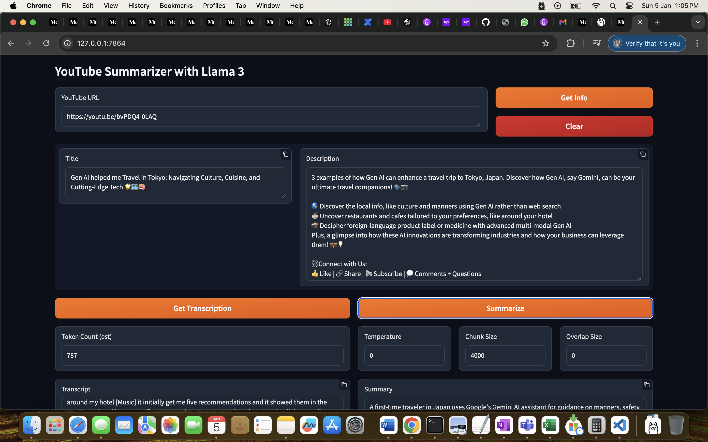
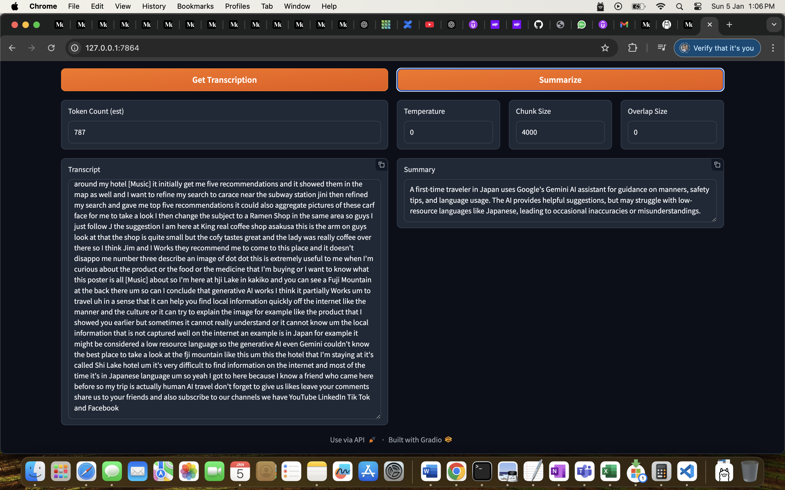

### README: YouTube Summarizer with Llama 3

---

## **Overview**
This project provides a web-based application to extract and summarize YouTube video content using the Llama 3 model, LangChain, and Gradio. The tool retrieves video information (title and description), extracts the video transcript, and generates concise summaries of the content.

---

## **Features**
1. **Video Info Retrieval:**
   - Fetches the title and description of the given YouTube video.

2. **Transcript Extraction:**
   - Retrieves the video's transcript using LangChain's `YoutubeLoader`.

3. **Summarization:**
   - Summarizes the transcript using the Ollama Llama model (`llama3.2:1b`) with adjustable parameters like temperature, chunk size, and overlap size.

4. **Interactive UI:**
   - Provides an easy-to-use Gradio interface for seamless interaction.

---

## **Installation**

### **Prerequisites**
- Python 3.8 or higher
- `ffmpeg` installed and added to PATH
- Internet access for downloading YouTube transcripts and model resources

### **Steps**
1. Clone the repository:
   ```bash
   git clone https://github.com/VinitPahwa1985/YouTuberSummarizer.git
   cd youtube-summarizer-llama3
   ```

2. Install dependencies:
   ```bash
   pip install -r requirements.txt
   ```

3. Pull the Ollama model:
   ```bash
   ollama pull llama3.2:1b
   ```

4. Run the application:
   ```bash
   python app.py
   ```

---

## **Usage**
1. Open the application in your browser (the URL will be displayed in the terminal after launching).
2. Enter the YouTube video URL in the input box.
3. Use the buttons to:
   - **Get Info**: Fetch the title and description of the video.
   - **Get Transcription**: Retrieve the video's transcript.
   - **Summarize**: Generate a summary of the transcript.

4. Adjust parameters for summarization:
   - **Temperature**: Controls the randomness of the summary.
   - **Chunk Size**: Sets the size of text chunks for processing.
   - **Overlap Size**: Determines the overlap between consecutive chunks.

---

## **Code Structure**
- `get_youtube_info(url)`: Fetches the video title and description using `yt_dlp`.
- `get_youtube_transcription(url)`: Extracts the transcript using LangChain's `YoutubeLoader`.
- `get_transcription_summary(url, temperature, chunk_size, overlap_size)`: Summarizes the transcript using the Llama model.
- `Gradio UI`: Provides an interactive web interface for the tool.

---

## **Dependencies**
- [yt-dlp](https://github.com/yt-dlp/yt-dlp)
- [LangChain](https://github.com/hwchase17/langchain)
- [Ollama](https://ollama.ai/)
- [Gradio](https://gradio.app/)
- [Tiktoken](https://github.com/openai/tiktoken)
- `requests`
- `pytube`
- `ffmpeg`

---

## **Troubleshooting**
- **Transcript Error**: Ensure the video has subtitles available.
- **Model Not Found**: Make sure the Ollama server is running and the model is pulled.
- **FFmpeg Issues**: Install and configure `ffmpeg` correctly.

---

## **Future Enhancements**
- Add support for multiple summarization models.
- Allow batch processing of videos.
- Display estimated summarization cost.

---

## **Contributing**
Feel free to submit issues or pull requests to enhance the project. Follow the [Contributor's Guide](CONTRIBUTING.md) for more details.

---

## **License**
This project is licensed under the MIT License. See the [LICENSE](LICENSE) file for details. 

---

## **Acknowledgments**
- LangChain Community
- Ollama.ai for the Llama models
- Gradio for the interactive interface
- YouTube for providing transcript APIs

--- 

Let me know if you'd like to customize this further! 🚀

Demo



